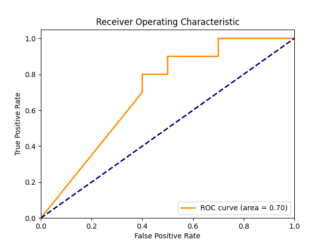
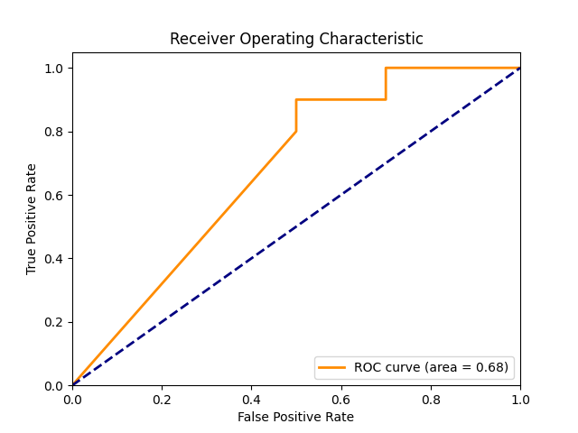
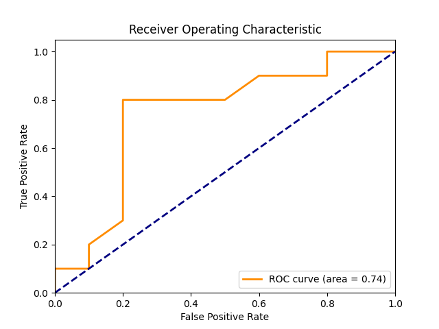
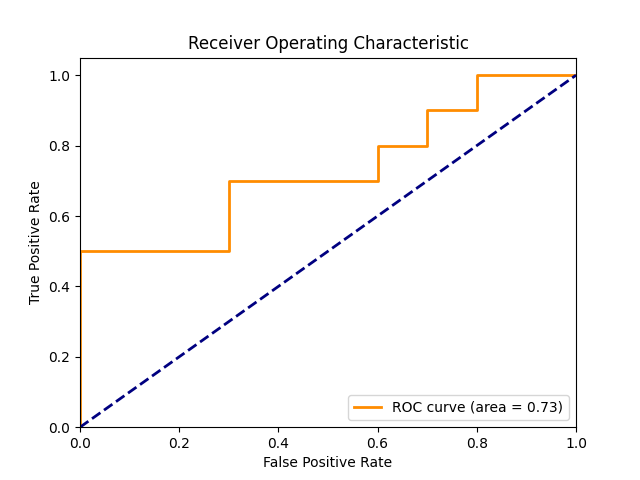
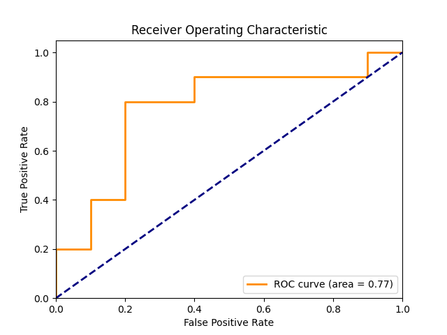
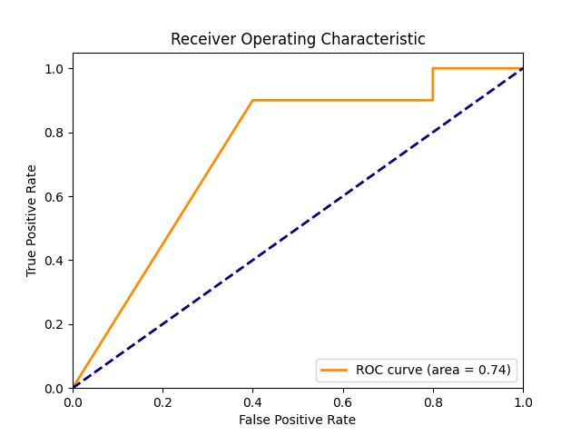
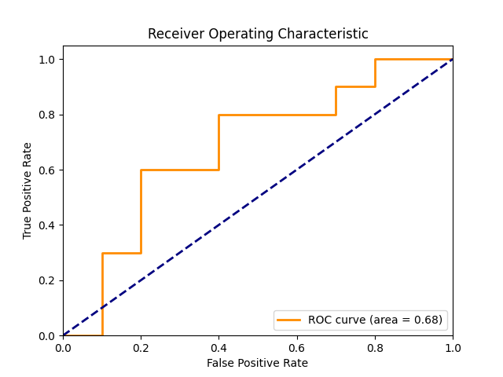

# Implementation of MIA Attacks (PyTorch)

## Current Attacks
* Baseline Attack (Attacker has full knowledge of training and testing losses/confidence scores/probability vector of target model)
* Shadow Attack [1]
* LiRA [2]
* RMIA [3]
* Quantile Regression [4]


## Commands

### Baseline Attack
```code
python main_baseline.py --choice loss
python main_baseline.py --choice conf
python main_baseline.py --choice prob
```

### Shadow Attack
```code
python main_shadow_attack.py
```

### LiRA
```code
python main_lira.py
```


### RMIA
```code
python main_rmia.py
```


### Quantile Regression
```code
python main_quantile.py
```


| Attack | ROC Curve (10 train samples & 10 test samples) |
|-------|--------|
| Baseline Attack Confidence |  |
| Baseline Attack Loss |  |
| Baseline Attack Probability |  |
| LIRA Attack |  |
| Quantile Attack |  |
| RMIA Attack |  |
| Shadow Attack |  |


## References
[1] Shokri, R., Stronati, M., Song, C. and Shmatikov, V., 2017, May. Membership inference attacks against machine learning models. In 2017 IEEE symposium on security and privacy (SP) (pp. 3-18). IEEE.

[2] Carlini, Nicholas, Steve Chien, Milad Nasr, Shuang Song, Andreas Terzis, and Florian Tramer. "Membership inference attacks from first principles." In 2022 IEEE Symposium on Security and Privacy (SP), pp. 1897-1914. IEEE, 2022.

[3] Zarifzadeh, Sajjad, Philippe Liu, and Reza Shokri. "Low-Cost High-Power Membership Inference Attacks." In Forty-first International Conference on Machine Learning. 2024.

[4] Bertran, Martin, Shuai Tang, Aaron Roth, Michael Kearns, Jamie H. Morgenstern, and Steven Z. Wu. "Scalable membership inference attacks via quantile regression." Advances in Neural Information Processing Systems 36 (2024).
